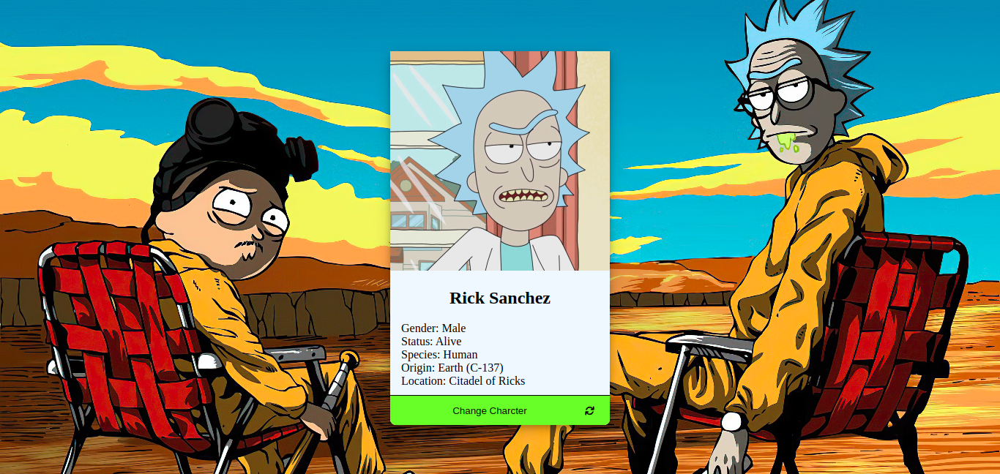
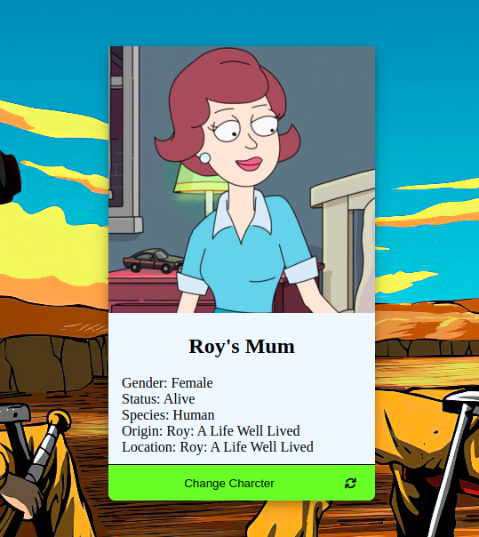

<h1 class="title" >This is a remake of an old project</h1>

  The reason for this remake is that the website was too simple to even deserve
  it's own repo. Plus, I wanted to use some new knowledge I acquired over the
  last couple of weeks such as: Typescript, Axios, Next.js and (finally, giving
  up vanilla CSS to use a library 😔) Material UI.

<h2>The old version:</h2>
<section >
  
  
  
*Literally just a card with a button to generate a random character (disgusting)

</section>

 

<h2>The version she tells you not to worry about:</h2>
<section >
  
in progress...

</section>
